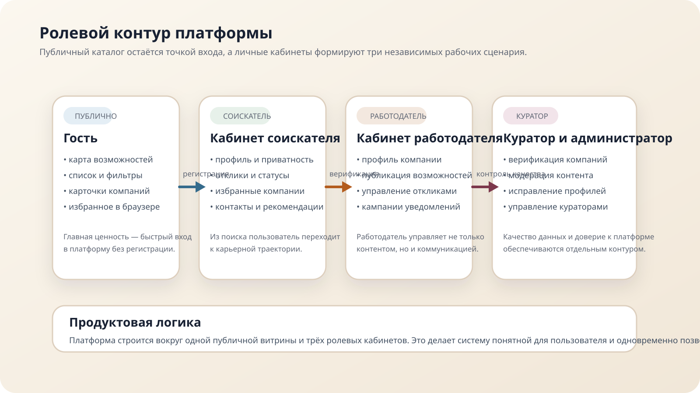
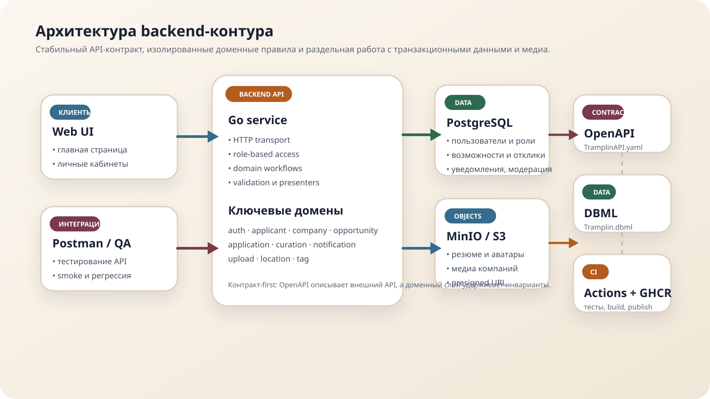
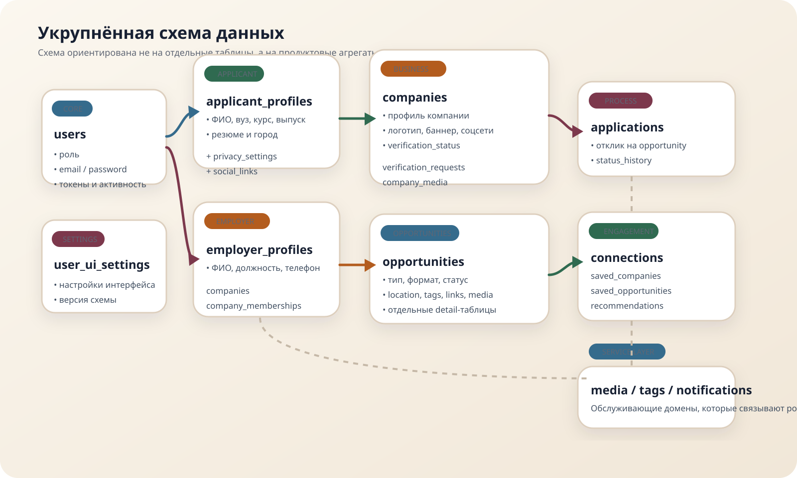
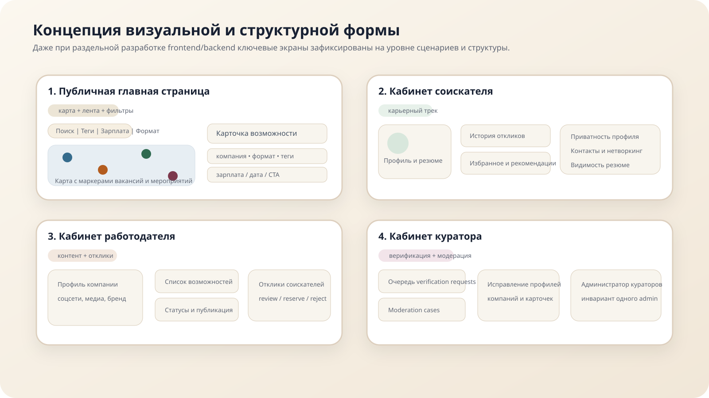

<!--
  Перед финальным экспортом заменить:
  1. <ссылка на репозиторий>
  2. <ссылка на видео>
  3. состав команды на слайде "Команда"
-->

<!-- _class: lead -->

# Трамплин
## Интерактивная карьерная платформа для студентов, выпускников, работодателей и кураторов

Платформа объединяет **поиск возможностей**, **нетворкинг**, **верификацию компаний** и **модерацию контента** в одном цифровом контуре.

  Go
  OpenAPI 3.1
  PostgreSQL
  MinIO / S3
  Docker Compose
  GitHub Actions + GHCR

  <strong>Конкурсная цель:</strong> показать целостное решение, в котором раскрыты продуктовая концепция, архитектура, модель данных, авторские решения, безопасность и эксплуатация.

Репозиторий: <code>&lt;ссылка на репозиторий&gt;</code> 
Видео-демо: <code>&lt;ссылка на видео&gt;</code>

---

# 1. Проблема и цель проекта

  

    <h3>Проблема рынка</h3>
    <ul>
      <li>Начинающим специалистам сложно найти <strong>первую стажировку или работу</strong> без релевантного опыта.</li>
      <li>Существующие сервисы плохо покрывают <strong>менторство, карьерные мероприятия и нетворкинг</strong>.</li>
      <li>У вузов и компаний нет общего контура для <strong>проверки работодателей</strong> и безопасной модерации контента.</li>
    </ul>
  

  

    <h3>Цель «Трамплина»</h3>
    <ul>
      <li>Собрать вакансии, стажировки, менторские программы и события в <strong>едином публичном каталоге</strong>.</li>
      <li>Дать соискателю путь от интереса к отклику, контактам, рекомендациям и карьерному росту.</li>
      <li>Дать работодателю удобный контур публикации, а куратору — инструменты верификации и модерации.</li>
    </ul>
  

  

4 роли

гость, соискатель, работодатель, куратор

  

4 типа

стажировки, вакансии, менторские программы, события

  

2 вида

карта и список на главной странице

  

1 контур

данные, медиа, уведомления и модерация в едином API

---

# 2. Роли и пользовательские потоки

  

    <h3>Соискатель</h3>
    
Ищет возможности на карте и в ленте, сохраняет компании, откликается, настраивает приватность, ведёт профиль и профессиональные контакты.

  

  

    <h3>Работодатель и куратор</h3>
    
Работодатель публикует возможности и работает с откликами. Куратор проверяет компании, модерирует контент и поддерживает качество данных платформы.

  

---

# 3. Что входит в реализованный контур

| Контур | Что реализовано |
|---|---|
| Публичная часть | Каталог компаний и возможностей, карта/список, фильтры, карточки, публичные теги |
| Соискатель | Профиль, приватность, теги, соцссылки, избранное, отклики, контакты, рекомендации |
| Работодатель | Профиль, компания, участники компании, социальные ссылки, медиа, возможности, отклики |
| Куратор | Верификация компаний, модерация кейсов, исправление профилей и карточек, управление тегами |
| Администрирование | Инвариант единственного администратора и управление аккаунтами кураторов |
| Инфраструктура | PostgreSQL, MinIO, Docker Compose, сидер, интеграционные тесты, CI/CD и публикация контейнера |

<blockquote>
Важный результат: в текущем API-контракте отсутствуют route-level <code>501 not_implemented</code>. То есть демонстрируется не отдельный модуль, а законченный backend-контур проекта.
</blockquote>

---

# 4. Авторские решения, которые влияют на балл

  

    <h3>Верификация работодателей</h3>
    
<strong>Несколько способов подтверждения:</strong> корпоративная почта, ИНН, официальный сайт, ручная проверка.

    
Это снижает входной барьер для компаний, но сохраняет управляемость и доверие к платформе.

  

  

    <h3>Модерация как отдельный домен</h3>
    
Кейсы модерации, статусы, назначение кураторов и причина решения вынесены в самостоятельный workflow.

    
Решение прозрачно, аудируемо и масштабируется на компании, профили, медиа и возможности.

  

  

    <h3>Нетворкинг и приватность</h3>
    
Контакты между соискателями, рекомендации и разграничение видимости профиля, резюме и откликов.

    
Это превращает проект из job board в карьерную экосистему.

  

  

    <h3>Единая модель тегов</h3>
    
Системные теги и пользовательские теги работодателей/кураторов живут в одной модели с типами и модерацией.

  

  

    <h3>Медиа через подписанные URL</h3>
    
Файлы загружаются напрямую в объектное хранилище, а backend управляет правами доступа и метаданными.

  

  

    <h3>Контракт-first подход</h3>
    
<code>TramplinAPI.yaml</code> и <code>Tramplin.dbml</code> используются как источник правды для API и структуры данных.

  

---

# 5. Архитектура решения

  

    
  

  

    <h3>Ключевые принципы</h3>
    <ul>
      <li><strong>Frontend и backend разделены</strong>: команда интерфейса работает независимо от серверной реализации.</li>
      <li><strong>Go backend</strong> реализует бизнес-правила, роли, инварианты и аудит действий.</li>
      <li><strong>PostgreSQL</strong> хранит транзакционные данные, статусы и связи между сущностями.</li>
      <li><strong>MinIO</strong> обслуживает медиафайлы через S3-совместимый API и подписанные URL.</li>
      <li><strong>Docker Compose</strong> поднимает полный стек для локальной демонстрации и QA.</li>
      <li><strong>GitHub Actions</strong> проверяет тесты и публикует контейнер в GHCR.</li>
    </ul>
  

---

# 6. Почему выбран именно этот стек

| Технология | Почему выбрана |
|---|---|
| Go | Высокая предсказуемость, простая эксплуатация, хорош для API и строгих доменных правил |
| OpenAPI 3.1 | Жёсткий контракт между командами, генерация коллекций, удобство для Postman и тестов |
| PostgreSQL | Реляционная модель хорошо подходит для ролей, статусов, историй, модерации и уведомлений |
| MinIO / S3 | Масштабируемая работа с файлами и безопасный доступ через presigned URL |
| Docker Compose | Один сценарий запуска полного backend-стека на любой машине с Docker |
| GitHub Actions + GHCR | Автоматическая валидация, публикация образа и воспроизводимое развёртывание |

<blockquote>
Стек не «модный ради модности», а подчинён требованиям проекта: роль-модель, прозрачные workflow, безопасность данных и удобная демонстрация на защите.
</blockquote>

---

# 7. Модель данных: ядро платформы

  

    <h3>Структура</h3>
    
Основой являются <strong>users</strong>, профили по ролям, <strong>companies</strong>, <strong>opportunities</strong>, <strong>applications</strong>, <strong>notifications</strong> и <strong>media_files</strong>.

  

  

    <h3>Почему это важно</h3>
    
Такая модель покрывает не только CRUD, но и жизненные циклы: приглашения в компанию, верификацию, статусы откликов, модерацию и персонализированную коммуникацию.

  

---

# 8. Критические инварианты и бизнес-правила

  

    <h3>Членство в компании</h3>
    
Приглашение → одобрение → отклонение/отзыв. Только утверждённые участники управляют карточками компании.

  

  

    <h3>Жизненный цикл возможностей</h3>
    
<code>draft → planned → active → closed → archived</code>, плюс модерационный статус и публичные правила публикации.

  

  

    <h3>Отклики и история статусов</h3>
    
Один отклик на пару «соискатель/возможность», статусы фиксируются в истории, изменения доступны обеим сторонам.

  

  

    <h3>Единственный администратор</h3>
    
В системе в любой момент существует ровно один платформенный администратор-куратор.

  

  

    <h3>Приватность профиля</h3>
    
Видимость резюме, откликов и контактов рассчитывается по ролям, настройкам пользователя и контексту доступа.

  

  

    <h3>Доступ к медиа</h3>
    
Права на файлы наследуются от сущности, к которой прикреплён файл; публичность не задаётся отдельно вручную.

  

---

# 9. Безопасность и надёжность

  

    <h3>Безопасность</h3>
    <ul>
      <li>JWT в <strong>HttpOnly cookies</strong> для браузерного сценария.</li>
      <li>Разделение access/refresh токенов и глобальный <code>token_version</code>.</li>
      <li>Прямые загрузки в MinIO без проксирования бинарных данных через backend.</li>
      <li>Presigned URL с ограниченным TTL и серверной проверкой при завершении загрузки.</li>
      <li>Ролевая модель: соискатель, работодатель, куратор, администратор.</li>
    </ul>
  

  

    <h3>Надёжность качества</h3>
    <ul>
      <li>Интеграционные тесты на PostgreSQL.</li>
      <li>Отдельные real-MinIO тесты на upload/download flow.</li>
      <li>Health-check endpoints и автоматическое применение миграций.</li>
      <li>Postman-коллекция из OpenAPI для ручной проверки API.</li>
      <li>Публикация контейнера только после прохождения CI-проверок.</li>
    </ul>
  

---

# 10. Структура пользовательского интерфейса

  

    <h3>Публичная часть</h3>
    
Главная страница сочетает карту, ленту и фильтры. Это соответствует ТЗ и позволяет показать как географический, так и каталоговый сценарий поиска.

  

  

    <h3>Личные кабинеты</h3>
    
Кабинеты разделены по ролям и не смешивают ответственность: соискатель работает с карьерным треком, работодатель — с контентом и откликами, куратор — с качеством платформы.

  

---

# 11. Эксплуатация и демонстрация решения

| Контур | Что даёт команде и жюри |
|---|---|
| `make docker-bootstrap` | Быстрый запуск полного backend-стека для демонстрации |
| Seeder | Повторяемые демо-данные: компании, возможности, отклики, уведомления, модерация |
| GHCR image | Публикация воспроизводимого контейнера после CI |
| Compose | Единый сценарий запуска на Linux, macOS и Windows с Docker Desktop |
| OpenAPI + Postman | Быстрая ручная проверка сценариев без дополнительного кода |

<blockquote>
Для защиты это критично: система не только спроектирована, но и удобно разворачивается, тестируется и демонстрируется на чистой машине.
</blockquote>

---

# 12. Как решение закрывает критерии оценки

| Критерий жюри | Чем закрываем |
|---|---|
| Базовый функционал платформы | Публичный каталог, карта/список, регистрация, авторизация, разграничение ролей |
| Личный кабинет соискателя | Профиль, приватность, избранное, отклики, рекомендации, контакты |
| Личный кабинет работодателя | Компания, публикация возможностей, работа с откликами, уведомления |
| Личный кабинет куратора | Верификация, модерация, исправление данных, администрирование кураторов |
| Карточки возможностей | Типы, форматы, теги, локации, ссылки, медиа, жизненный цикл |
| Авторские решения | Верификация компаний, политика приватности, нетворкинг, moderation workflow, media access |
| Качество реализации | Контракт-first, интеграционные тесты, CI, контейнеризация, безопасность |
| Презентация и видеоролик | Структурированная история проекта, акцент на решениях и воспроизводимой демонстрации |

---

# 13. Команда проекта

  

    <h3>Product / Analysis</h3>
    
<strong>&lt;ФИО&gt;</strong>

    
Проработка сценариев, анализ ТЗ, формирование функционального объёма, презентация и защита решений.

  

  

    <h3>Backend / Data</h3>
    
<strong>&lt;ФИО&gt;</strong>

    
API, модель данных, бизнес-правила, интеграционные тесты, контейнеризация и CI/CD.

  

  

    <h3>Frontend / UX</h3>
    
<strong>&lt;ФИО&gt;</strong>

    
Интерфейс главной страницы, личных кабинетов и визуальная логика ролей.

  

  <h3>Командный процесс</h3>
  
Разделение по доменам и стабильный OpenAPI-контракт позволили параллельно вести backend, интерфейс и презентационные материалы без конфликтов в архитектуре.

---

# 14. Итог

  

    <h3>Что получилось</h3>
    <ul>
      <li>Целостная карьерная платформа, закрывающая роли соискателя, работодателя и куратора.</li>
      <li>Архитектура, пригодная для развития: OpenAPI, контейнеризация, объектное хранилище, CI/CD.</li>
      <li>Сильные авторские решения в зонах неопределённости ТЗ: верификация, приватность, нетворкинг и модерация.</li>
    </ul>
  

  

    <h3>Что важно показать на защите</h3>
    <ul>
      <li>Главная страница: карта + список + фильтры.</li>
      <li>Кабинет работодателя и работу с откликами.</li>
      <li>Кабинет соискателя: профиль, избранное, контакты.</li>
      <li>Панель куратора: верификация, модерация, исправления.</li>
      <li>Быстрый запуск через Docker и воспроизводимость окружения.</li>
    </ul>
  

  <strong>Следующий шаг перед сдачей:</strong> подставить ссылки на репозиторий и видео, заменить ФИО команды и при желании вставить реальные скриншоты интерфейса вместо структурных схем.

